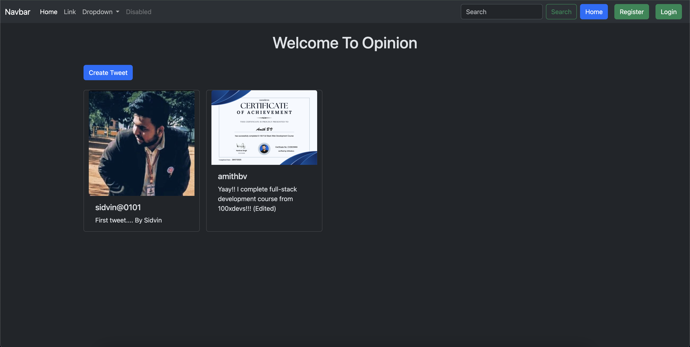
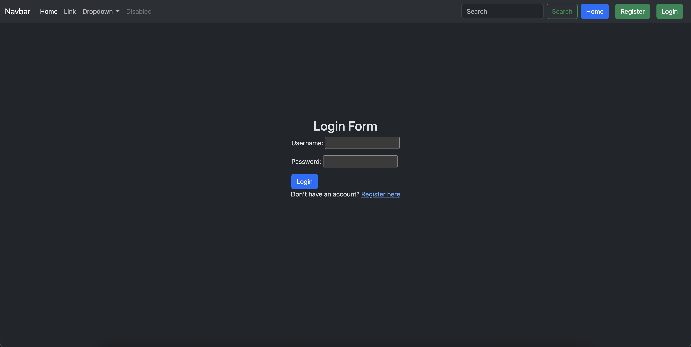
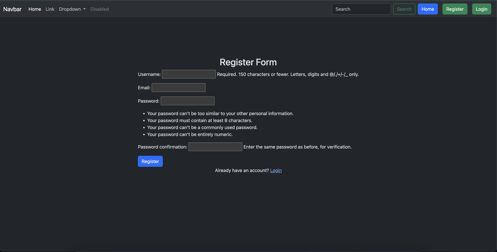
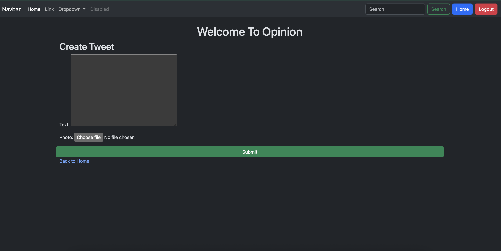

# Opinion

A Twitter-like Full-Stack Django application that allows users to share their opinions, follow other users, and engage with content through likes and comments.

## ScreenShots :






## 🚀 Features

- **User Authentication**: Sign up, login, logout functionality
- **Opinion Posts**: Create, edit, and delete opinion posts

## 🛠️ Tech Stack

- **Backend**: Django 5
- **Frontend**: HTML5, Bootstrap
- **Database**: SQLite (development)
- **Authentication**: Django's built-in authentication system
- **Styling**: Bootstrap 5

## 📋 Prerequisites

Before you begin, ensure you have met the following requirements:

- Python 3.8 or higher
- pip (Python package manager)
- Git

## 🔧 Installation

1. **Clone the repository**
   ```bash
   git clone https://github.com/AmithBV0606/Opinion.git
   cd Opinion
   ```

2. **Create a virtual environment**
   ```bash
   python -m venv opinion_env
   ```

3. **Activate the virtual environment**
   
   On Windows:
   ```bash
   opinion_env\Scripts\activate
   ```
   
   On macOS/Linux:
   ```bash
   source opinion_env/bin/activate
   ```

4. **Install dependencies**
   ```bash
   pip install -r requirements.txt
   ```

5. **Set up environment variables**
   Create a `.env` file in the root directory and add:
   ```
   SECRET_KEY=your-secret-key-here
   DEBUG=True
   DATABASE_URL=sqlite:///db.sqlite3
   ```

6. **Run database migrations**
   ```bash
   python manage.py makemigrations
   python manage.py migrate
   ```

7. **Create a superuser (optional)**
   ```bash
   python manage.py createsuperuser
   ```

8. **Start the development server**
   ```bash
   python manage.py runserver
   ```

9. **Access the application**
   Open your browser and navigate to `http://127.0.0.1:8000/`

## 🎯 Usage

### Creating an Account
1. Click on "Sign Up" from the homepage
2. Fill in your details (username, email, password)
3. Verify your email (if email verification is enabled)
4. Login with your credentials

### Posting Opinions
1. Navigate to your dashboard after logging in
2. Click on "Share Opinion" or similar button
3. Write your opinion (character limit may apply)
4. Click "Post" to share your opinion

### Following Users
1. Search for users or browse user profiles
2. Click "Follow" on any user's profile
3. Their posts will appear in your timeline


## 👤 Author

**Amith BV**
- GitHub: [@AmithBV0606](https://github.com/AmithBV0606)
- LinkedIn: [Your LinkedIn Profile](https://linkedin.com/in/your-profile)

## 🙏 Acknowledgments

- Django framework and community
- Bootstrap for responsive design
- Font Awesome for icons
- All contributors and users of this project
